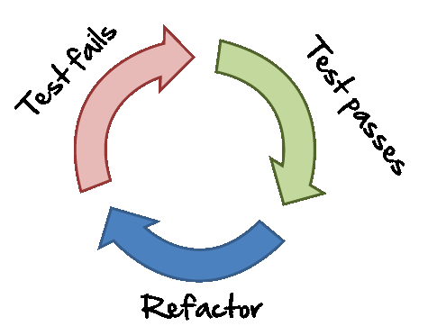
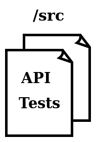
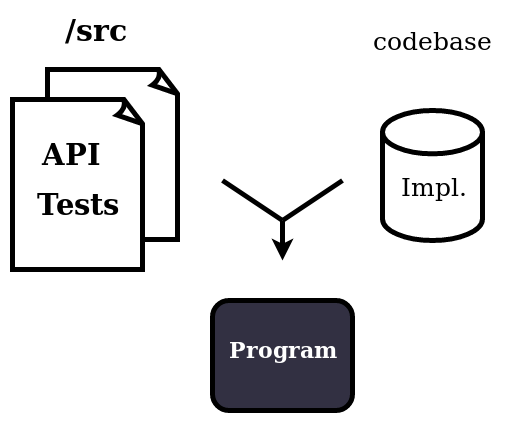

@snap[north-west text-08 text-black]
@fa[twitter] [@adrien_piquerez](https://twitter.com/adrien_piquerez)
[gitlab.com/adrien.piquerez](https://gitlab.com/adrien.piquerez)
@snapend

## Test-Safe Programming
#### @fa[quote-left] TDD by design

---

@snap[west span-50]
### Test-driven development
@fa[quote-left text-07]()@size[0.7em](TDD encourages simple designs and inspire confidence. - Kent Beck)
@snapend

@snap[east span-50]

@snapend

---

@snap[north span-80]
### Benefits of TDD
@snapend

@ul[list-circle-bullets list-spaced-bullets](false)
- Validation of the software
- Focus on the requirements
- Focus on the interfaces
@ulend

---

@snap[north span-80]
### Drawbacks of TDD
@snapend

@ul[list-circle-bullets list-spaced-bullets](false)
- TDD is hard
- Tests and code are covariant
- TDD is a practice
@ulend

---

@snap[north span-80]
### Test-Safe Programming
@snapend

@snap[west span-50]

@snapend

@snap[east span-50]
@ul[list-circle-bullets text-08](false)
- Tests are expressive
- Tests are strongly decoupled
- Tests are non exhaustive
@ulend
@snapend

---

@snap[north span-80]
### Test-Safe Programming
@snapend

---

## Demo

---

@snap[midpoint span-100 text-08]
@fa[quote-left] The hardest part of software task is arriving at a complete and consistent specification, and much of the essence of building a program is in fact the debugging of the specification.
@snapend

@snap[south-east span-80 text-08 text-right]
No Silver Bullet - F. Brooks
@snapend

---